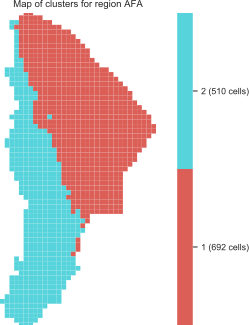
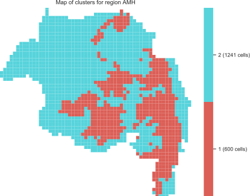
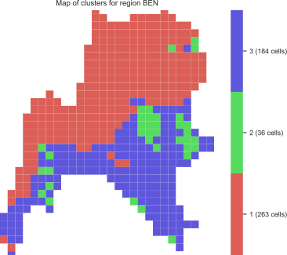
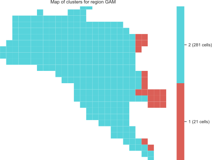
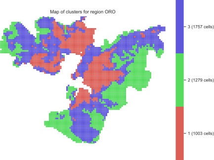
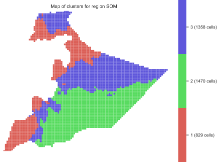
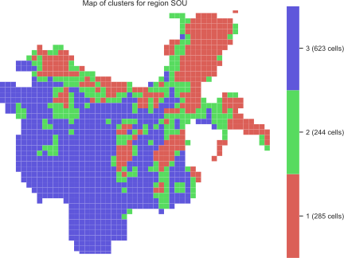
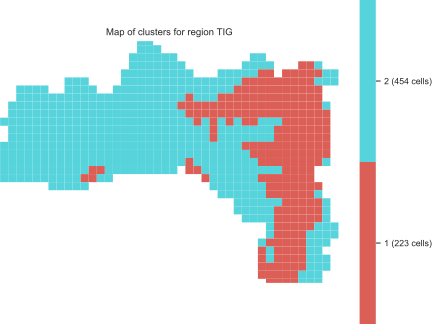

====
Data
====

Socio-economic trends
^^^^^^^^^^^^^^^^^^^^^
Population (millions)
---------------------
**Source**: *Population Dynamics and Priority Issues 
for Ethiopia’s 15 Years Perspective Development Plan, 2018, 
Ethiopian Academy of Sciences*

.. csv-table:: 
   :file: ./tables/population.csv
   :widths: 50, 25, 25, 25, 25
   :header-rows: 1

GDP growth (%)
--------------
**Source**: *Planning and Development Commission of Ethiopia*

.. csv-table:: 
   :file: ./tables/gdp.csv
   :widths: 70, 25, 25, 25, 25, 25, 25
   :header-rows: 1

Energy sector
^^^^^^^^^^^^^
Demands (Petajoules)
--------------------
**Source**: *Own projections based on data from IEA World Energy Statistics (2018)*

.. csv-table:: 
   :file: ./tables/energy_demands.csv
   :widths: 50, 50, 50, 50, 50, 25, 25, 25, 25
   :header-rows: 1

Powerplants - existing capacity (Gigawatts)
-------------------------------------------
**Source**: *Ministry of Water, Irrigation and Energy - Ethiopia*

.. csv-table:: 
   :file: ./tables/powerplant_capacity_existing.csv
   :widths: 50, 50, 50, 25, 25, 25, 25
   :header-rows: 1

Powerplants - planned capacity (Gigawatts)
------------------------------------------
**Source**: *Ministry of Water, Irrigation and Energy - Ethiopia*

.. csv-table:: 
   :file: ./tables/powerplant_capacity_planned.csv
   :widths: 50, 50, 50, 50, 25, 25, 25, 25
   :header-rows: 1

Land use
^^^^^^^^
Land area by land use (1000 sq.km.)
-----------------------------------
Source: Global Agro-ecological Zones (GAEZ), FAO/IIASA

.. csv-table:: 
   :file: ./tables/land_area.csv
   :widths: 50, 50, 50, 50, 50, 50, 50, 50, 50, 50
   :header-rows: 1

Crops: harvested area and production (2016)
-------------------------------------------
Source: FAOSTAT Agriculture Statistics

.. csv-table:: 
   :file: ./tables/crop_production.csv
   :widths: 50, 50, 50, 50, 50
   :header-rows: 1

Clustering results
------------------
The CLEWs-Ethiopia model is spatially resolved into 'clusters' of land. 
The clusters are determined by aggregating cells in each region based on the 
similarity in their agro-climatic characteristics. 

Below are the results of the clustering algorithm for each region. 
NOTE: Addis Ababa (ADD) is not shown below as it is represented by a single cluster:

**Afar (AFA)**

**Amhara (AMH)**

**Benishangul-Gumuz (BEN)**

**Gambela (GAM)**

**Oromia (ORO)**

**Somali region (SOM)**

**Southern Nations, Nationalities, and Peoples' Region (SOU)**

**Tigray (TIG)**

Water sector
^^^^^^^^^^^^
Water demand by sector (Billion cubic metres)
---------------------------------------------
**Source**: *Ministry of Water, Irrigation and Energy - Ethiopia*

.. csv-table:: 
   :file: ./tables/water_demand.csv
   :widths: 50, 50, 50, 50, 50
   :header-rows: 1

